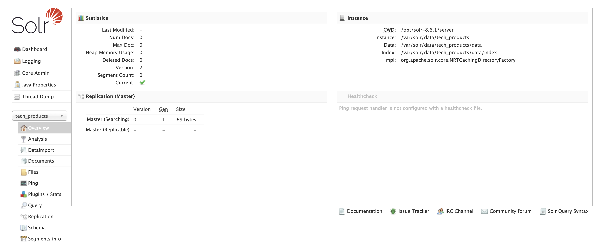

# Intro
This repository shows how to get a Solr instance in a Docker container up and running & to ingest data programetically

## Dependencies
- Docker swarm cluster _(only using a one-node cluster for now. See **Future improvements** section below)_

## Deploy Solr instance
Running the following commands will create an overlay & attachable network and then start Solr as a swarm service
- `docker network create --driver overlay --attachable sorl_net`
- `docker stack deploy --compose-file docker-compose.yml solr`

Please note for now, solr is not running in a cluster formation. That might be some future work

## Check stack status
- `docker stack services solr`
- `docker stack ps --no-trunc solr` _(address any error reported at this point)_

If no error is encountered, then Solr dashboard will be available at the following URL. You will notice number of documents to be zero at this moment
- http://[YOUR_HOST_NAME]:8983/solr/#/tech_products/core-overview
  - Part of standing up the stack _(docker-compose.yml)_, a core called `tech_products` will be created
  - If in case, you used provided Vagrantfile to create the swarm cluster, you can swap `YOUR_HOST_NAME` with `node1` in the URL above

## Ingest sample data that is distrubuted with Solr
- `docker container exec -it $(docker ps -q) bash` _(exec into the solr container)_
- `cd example/exampledocs`
- `java -jar -Dc=tech_products post.jar *.xml`

If you now refreshed Solr dashboard, you will notice number of documents are no longer zero. The sample data that is included in the Solr download / distribution has been ingested in solr engine

## Ingest custom data with Node.js
At this point `solr` swarm service is already running on an attachable network called `sorl_net`. We are now going start another container on the same network so that data could be pushed to Solr programetically with Node.js
- `cd nodeapp`
- `docker run -it --rm --name nodeapp --network=sorl_net -v "$PWD":/usr/src/app -w /usr/src/app node:latest bash`
- `npm install solr-node`
- `node index.js`  _(before executing this command, you will need to uncomment parts of **index.js** to add, delete or search data. Comments are self-explanatory)_

Assuming you uncommented the code that adds a bunch of data _(people.json)_, you will notice the number of docs on the solr dashboard has increaded

Similarly, you could programetically search or delete data

## Destroy Solr instance
- `docker stack remove solr`

## Future improvements
- One improvement might be to run Solr in a cluster configuration

# Reference
- Getting Started Tutorial - https://youtu.be/Zw4M4NGv-Rw.  This is an excellent introduction to Solr - click on [commands](https://github.com/lucian-12/solr-course/blob/master/solr_installation_commands) that are executed in the video tutorial. Here is the official Solr getting started guide the video is referring to: https://lucene.apache.org/solr/guide/8_6/index.html
- In this first tutorial, Apache Solr is set up via Docker, and some documents added to the database: https://youtu.be/83tEFh-z9Hs
- In the second tutorial, NodeJS application is set up that talks to this solr database: https://youtu.be/ooQktBu-CXw
- Code for the last two tutorials above is found at: https://github.com/yongzhihuang/PentaCode/tree/master/solr